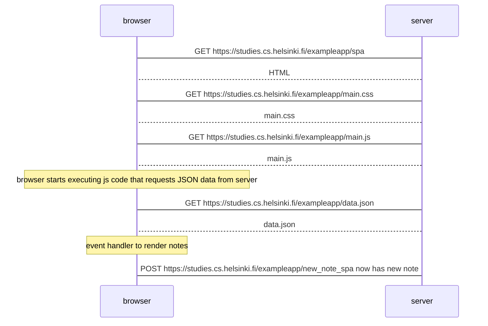

```mermaid
sequenceDiagram
    browser->server: GET https://studies.cs.helsinki.fi/exampleapp/spa
    server-->browser: HTML
    browser->server: GET https://studies.cs.helsinki.fi/exampleapp/main.css
    server-->browser: main.css
    browser->server: GET https://studies.cs.helsinki.fi/exampleapp/main.js
    server-->browser: main.js

    note over browser: browser starts executing js code that requests JSON data from server

    browser->server: GET https://studies.cs.helsinki.fi/exampleapp/data.json
    server-->browser: data.json

    note over browser: event handler to render notes

    browser->server: POST https://studies.cs.helsinki.fi/exampleapp/new_note_spa now has new note

```
